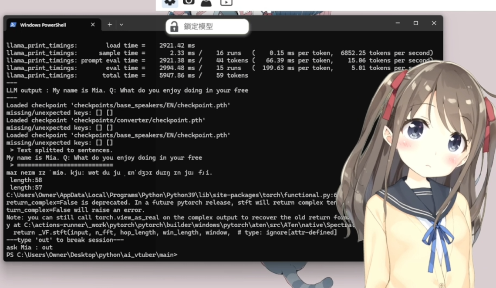

# AI-Vtuber

### 簡介 / Introduction

> [!NOTE]
> 這項專案透過本地端的語言模型和OpenVoice，打造出一個性化的Vtuber
> 
> 並透過Vtuber Studio 作為最終的介面與使用者互動
>
> ---
> 
> This project utilizes a local LLM and OpenVoice to creat a personalized Vtuber.
> 
> It interacts with users with Vtuber Studio as the final interface.


**TTS開源引用/TTS OpenSource** [OpenVoice](https://github.com/myshell-ai/OpenVoice)
>需要自行安裝TTS所需的文件
>
>must download the necessary file from the link

**預訓練模型/Pre-trained model**  [Mistral](https://huggingface.co/TheBloke/Mistral-7B-Instruct-v0.1-GGUF)
>於目錄下創建名為model的資料夾
>至連結中下載所需的預訓練模型並儲存於model下方
>
>Create a folder named "model" in the directory.
>
>Download the required pretrained models from the link and save them under the "model" folder.
>```
>main/
>
>└── model/
>
>      └── pre-trained model's file
>```


### 必要模組 Necessary modules

> [!IMPORTANT]
> **Pytorch** [Pytorch](https://pytorch.org/)
> 
> **llama_cpp** [Run Llama Locally](https://swharden.com/blog/2023-07-29-ai-chat-locally-with-python/)
> ```
>pip install  playsound
> ```

### 執行 檔案 / run file
```
python main.py
```

### Demo




